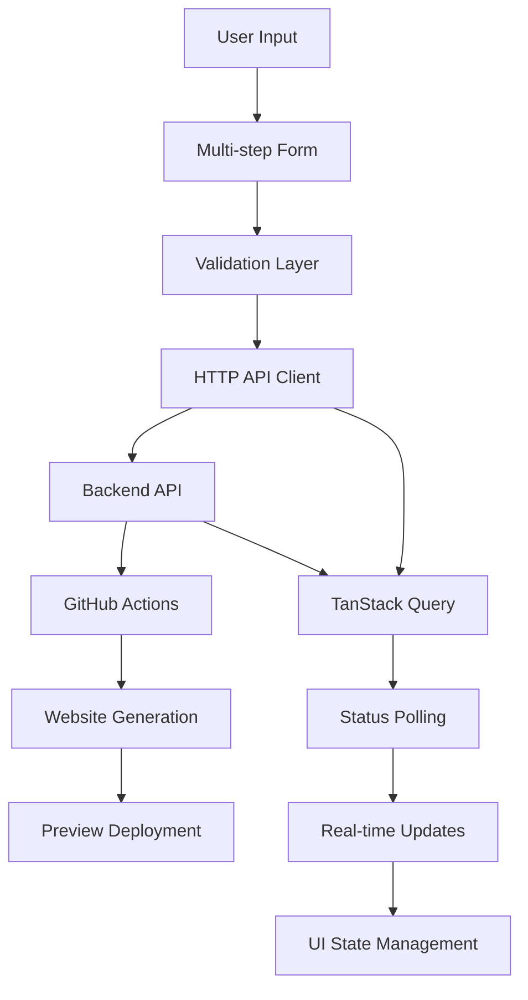

# Architecture Documentation

## System Overview

The Webler Client Portal is built using a modern, performant architecture that combines the best of static site generation with dynamic interactivity. The system follows a **HTTP + TanStack Query** pattern integrated with **GitHub Actions workflows** for a reliable, scalable website generation platform.

### Core Architectural Principles

1. **Performance First**: Astro's island architecture delivers optimal performance by rendering static content with selective interactivity
2. **Reliability**: HTTP-based communication provides better mobile support, easier testing, and more predictable behavior than WebSocket alternatives
3. **Developer Experience**: TypeScript, comprehensive error handling, and clear separation of concerns
4. **User Experience**: Real-time updates through intelligent polling, comprehensive loading states, and professional error feedback

## Technical Stack

### Frontend Framework
```
Astro 4.x (Static Site Generator)
├── React 19 (Islands Architecture)
├── TypeScript (Type Safety)
└── Tailwind CSS (Styling)
```

### Data Management
```
TanStack Query v5
├── HTTP Polling (Real-time Updates)
├── Smart Caching (Background Sync)
├── Retry Logic (Exponential Backoff)
└── Optimistic Updates (UX Enhancement)
```

### Backend Integration
```
HTTP API
├── RESTful Endpoints
├── GitHub Actions Triggers
├── Status Polling Endpoints
└── Error Handling
```

## System Architecture

### High-Level Data Flow



### Component Architecture

#### Core Application Structure
```
Layout.astro (Static Shell)
├── Header.astro (Static Navigation)
├── Main Content (Island)
│   ├── GeneratorForm.tsx (Interactive)
│   ├── ProgressTracker.tsx (Interactive)
│   └── ApiDemo.tsx (Interactive)
├── Footer.astro (Static)
└── Providers (React Context)
    ├── QueryProvider.tsx (TanStack Query)
    └── ToastProvider.tsx (Notifications)
```

#### Interactive Islands
- **GeneratorForm**: Multi-step form with validation and API integration
- **ProgressTracker**: Real-time status polling and progress display
- **ApiDemo**: API testing and demonstration interface
- **LoadingButton**: Buttons with integrated loading states
- **ErrorToast**: Professional notification system

#### Shared Components
- **LoadingSpinner**: Reusable loading indicators
- **AnimatedCard**: Interactive card components with hover effects
- **PageTransition**: Smooth page entrance animations
- **Skeleton**: Loading placeholders for better perceived performance
- **ErrorBoundary**: React error catching with fallback UI
- **FieldError**: Inline form validation feedback

## Data Flow Patterns

### Form Submission Flow
1. **Input Validation**: Client-side validation with real-time feedback
2. **API Request**: HTTP POST with form data and metadata
3. **Workflow Trigger**: Backend initiates GitHub Actions workflow
4. **Status Polling**: TanStack Query polls for status updates every 5 seconds
5. **Real-time Updates**: UI updates with progress and status information
6. **Completion**: Preview URL delivered and displayed to user

### Error Handling Flow
1. **Error Detection**: API errors, network failures, validation errors
2. **Error Classification**: Categorize by type (user, system, network)
3. **User Feedback**: Toast notifications with appropriate messaging
4. **Recovery Options**: Retry mechanisms and alternative actions
5. **Logging**: Error context preserved for debugging

### State Management
- **Server State**: TanStack Query manages all API data and caching
- **UI State**: React hooks for component-local state
- **Global State**: React Context for shared state (toasts, user preferences)
- **Form State**: Controlled components with validation state

## Component Patterns

### Provider Pattern
```typescript
// Global providers wrap the entire application
<QueryProvider>
  <ToastProvider>
    <App />
  </ToastProvider>
</QueryProvider>
```

### Island Pattern
```typescript
// Astro pages use islands for interactivity
---
// Static Astro component logic
---
<Layout>
  <h1>Static Content</h1>
  <GeneratorForm client:load />  <!-- Interactive island -->
</Layout>
```

### Hook Pattern
```typescript
// Custom hooks encapsulate API logic
export const useApiClient = () => {
  return useMutation({
    mutationFn: (data) => apiClient.post('/generate', data),
    onSuccess: () => showToast('Success!'),
    onError: (error) => showToast(error.message, 'error')
  });
};
```

### Error Boundary Pattern
```typescript
// Error boundaries catch React errors
<ErrorBoundary fallback={<ErrorFallback />}>
  <SuspenseWrapper>
    <InteractiveComponent />
  </SuspenseWrapper>
</ErrorBoundary>
```

## API Integration

### HTTP Client Configuration
```typescript
const apiClient = {
  baseURL: import.meta.env.PUBLIC_API_URL,
  timeout: 30000,
  retries: 3,
  headers: {
    'Content-Type': 'application/json'
  }
};
```

### TanStack Query Configuration
```typescript
const queryClient = new QueryClient({
  defaultOptions: {
    queries: {
      staleTime: 5 * 60 * 1000,      // 5 minutes
      cacheTime: 10 * 60 * 1000,     // 10 minutes
      retry: 3,
      retryDelay: attemptIndex => Math.min(1000 * 2 ** attemptIndex, 30000)
    }
  }
});
```

### Polling Strategy
```typescript
// Status polling with intelligent intervals
const { data: status } = useQuery({
  queryKey: ['job-status', jobId],
  queryFn: () => fetchJobStatus(jobId),
  refetchInterval: (data) => {
    if (data?.status === 'completed' || data?.status === 'failed') {
      return false; // Stop polling
    }
    return 5000; // Poll every 5 seconds
  },
  enabled: !!jobId
});
```

## Performance Optimization

### Astro Optimizations
- **Static Generation**: Pre-rendered pages for optimal loading
- **Island Architecture**: Minimal JavaScript hydration
- **Image Optimization**: Automatic image processing and optimization
- **CSS Optimization**: Automatic CSS bundling and minification

### TanStack Query Optimizations
- **Background Updates**: Fresh data without blocking UI
- **Request Deduplication**: Automatic deduplication of identical requests
- **Optimistic Updates**: Immediate UI updates with rollback capability
- **Intelligent Caching**: Reduces API calls and improves performance

### Loading Strategy
- **Skeleton Screens**: Better perceived performance during loading
- **Progressive Enhancement**: Core functionality works without JavaScript
- **Lazy Loading**: Components and routes loaded on demand
- **Prefetching**: Anticipate user needs and prefetch resources

## Security Architecture

### Input Validation
- **Client-side**: Immediate feedback and UX improvement
- **Schema Validation**: TypeScript schemas for data validation
- **Sanitization**: Input sanitization to prevent XSS attacks
- **Rate Limiting**: Client-side request throttling

### API Security
- **HTTPS Only**: All communication encrypted in transit
- **CORS Configuration**: Proper cross-origin resource sharing
- **Request Validation**: Server-side validation of all inputs
- **Error Handling**: No sensitive information in error messages

### Environment Configuration
- **Environment Variables**: Sensitive configuration via environment
- **Build-time Secrets**: API keys and secrets managed securely
- **Client-side Config**: Only safe-to-expose variables in client
- **Development vs Production**: Different security levels per environment

## Error Handling Architecture

### Error Classification
```typescript
type ErrorType =
  | 'network'     // Network connectivity issues
  | 'validation'  // Form validation errors
  | 'api'         // Backend API errors
  | 'system'      // Application errors
  | 'user';       // User action errors
```

### Error Recovery Strategies
- **Automatic Retry**: Network and temporary API errors
- **User Retry**: User-initiated retry for failed operations
- **Fallback UI**: Alternative interfaces when components fail
- **Error Boundaries**: Prevent error propagation and provide recovery

### Toast Notification System
```typescript
// Centralized notification management
const toastTypes = {
  error: { autoClose: false, duration: null },
  warning: { autoClose: true, duration: 6000 },
  success: { autoClose: true, duration: 4000 },
  info: { autoClose: true, duration: 5000 }
};
```

## Development Patterns

### File Organization
```
src/
├── components/
│   ├── astro/           # Static Astro components
│   └── react/           # Interactive React components
├── hooks/               # Custom React hooks
├── layouts/             # Page layouts
├── pages/               # Route definitions
├── providers/           # React context providers
├── styles/              # Global styles
└── utils/               # Utility functions
```

### TypeScript Patterns
- **Strict Mode**: Full TypeScript strict mode enabled
- **Interface Definitions**: Clear contracts for all data structures
- **Generic Components**: Reusable components with type safety
- **Environment Types**: Typed environment variable access

### Testing Strategy
- **Component Testing**: React Testing Library for component behavior
- **Integration Testing**: End-to-end user workflows
- **API Testing**: Mock API responses for reliable testing
- **Accessibility Testing**: Automated accessibility validation

## Deployment Architecture

### Build Process
1. **Static Generation**: Astro builds static pages
2. **Asset Optimization**: Images, CSS, and JavaScript optimization
3. **Bundle Analysis**: Size analysis and optimization recommendations
4. **Type Checking**: Full TypeScript validation
5. **Linting**: Code quality and consistency validation

### Hosting Strategy
- **Static Hosting**: Deployed to static hosting platforms (Netlify, Vercel)
- **CDN Distribution**: Global content delivery for optimal performance
- **Environment Configuration**: Environment-specific configuration
- **Monitoring**: Performance and error monitoring integration

### GitHub Actions Integration
```yaml
# Backend workflow integration
workflow_dispatch:
  inputs:
    business_info: { required: true }
    design_preferences: { required: true }
    content_requirements: { required: true }
```

## Performance Metrics

### Core Web Vitals Targets
- **Largest Contentful Paint (LCP)**: < 2.5 seconds
- **First Input Delay (FID)**: < 100 milliseconds
- **Cumulative Layout Shift (CLS)**: < 0.1
- **First Contentful Paint (FCP)**: < 1.5 seconds

### Bundle Size Targets
- **Initial Bundle**: < 500KB
- **Total Bundle**: < 2MB
- **Individual Components**: < 50KB
- **Critical CSS**: < 50KB

### API Performance Targets
- **API Response Time**: < 200ms (95th percentile)
- **Health Check**: < 100ms
- **Status Polling**: < 500ms
- **Form Submission**: < 1 second

## Future Architecture Considerations

### Scalability
- **Component Library**: Extract reusable components
- **Micro-frontends**: Potential future modularization
- **API Versioning**: Support for multiple API versions
- **Internationalization**: Multi-language support preparation

### Technology Evolution
- **Framework Updates**: Astro and React version migrations
- **Performance Monitoring**: Advanced analytics integration
- **Progressive Web App**: PWA capabilities for offline support
- **Real-time Updates**: Potential WebSocket integration for specific use cases

### Monitoring and Observability
- **Error Tracking**: Comprehensive error monitoring
- **Performance Analytics**: Real user monitoring (RUM)
- **User Behavior**: Analytics for UX optimization
- **API Monitoring**: Backend health and performance tracking