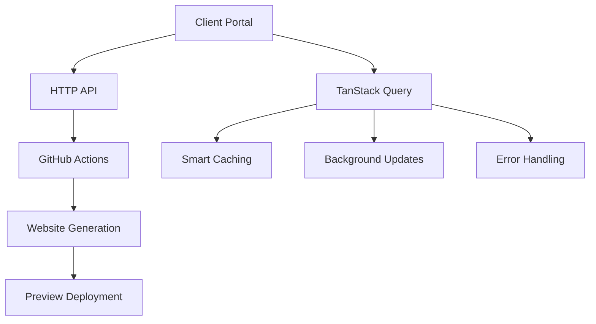

# Webler Client Portal

AI-powered website generation platform client portal built with Astro, React, TypeScript, and TanStack Query.

## Overview

The Webler Client Portal is a modern web application that allows service businesses to generate professional websites through an AI-powered interface. Built with Astro for optimal performance, React islands for interactive components, and HTTP-based API communication that integrates seamlessly with GitHub Actions workflows.

## ✨ Features

- 🚀 **Landing Page** - SEO-optimized marketing page with conversion focus
- 📝 **Interactive Form** - Multi-step website generation form with validation
- ⚡ **Real-time Progress** - HTTP polling with TanStack Query for status updates
- 🎨 **Preview & Activation** - Website preview with subscription flow
- 📱 **Mobile Responsive** - Optimized for all devices and screen sizes
- 🔄 **Loading States** - Professional loading animations and skeleton screens
- 🚨 **Error Handling** - Comprehensive error handling with user-friendly feedback
- 🍞 **Toast Notifications** - Success, error, warning, and info messages
- 🛡️ **Error Boundaries** - React error boundaries with fallback UI
- 🎭 **Animations** - Smooth micro-interactions and page transitions

## 🛠️ Tech Stack

### Frontend Framework
- **[Astro](https://astro.build/)** - Static site generator with React islands
- **[React 19](https://react.dev/)** - Interactive UI components
- **[TypeScript](https://www.typescriptlang.org/)** - Type safety and better DX

### Styling & UI
- **[Tailwind CSS](https://tailwindcss.com/)** - Utility-first CSS framework
- **[Lucide React](https://lucide.dev/)** - Beautiful icon library
- **Custom Components** - Professional loading states and animations

### Data Management
- **[TanStack Query](https://tanstack.com/query)** - Powerful data synchronization
- **HTTP Polling** - Reliable status updates without WebSocket complexity
- **Smart Caching** - Intelligent background updates and retry logic

### Development
- **[ESLint](https://eslint.org/)** - Code linting and quality
- **[Prettier](https://prettier.io/)** - Code formatting (if configured)
- **GitHub Actions** - CI/CD and website generation workflow

## 📁 Project Structure

```text
client-portal/
├── public/
│   └── images/                   # Static assets
├── src/
│   ├── components/
│   │   ├── astro/               # Astro components
│   │   │   ├── Header.astro
│   │   │   └── Footer.astro
│   │   └── react/               # React island components
│   │       ├── ApiDemo.tsx      # API demonstration component
│   │       ├── GeneratorForm.tsx # Website generation form
│   │       ├── ProgressTracker.tsx # Status tracking
│   │       ├── LoadingButton.tsx # Button with loading states
│   │       ├── LoadingSpinner.tsx # Reusable spinner
│   │       ├── ErrorToast.tsx   # Toast notifications
│   │       ├── ErrorBoundary.tsx # Error handling
│   │       ├── AnimatedCard.tsx # Hover animations
│   │       ├── PageTransition.tsx # Page animations
│   │       └── Skeleton.tsx     # Loading placeholders
│   ├── providers/
│   │   ├── QueryProvider.tsx    # TanStack Query setup
│   │   └── ToastProvider.tsx    # Toast management
│   ├── hooks/
│   │   └── useApiClient.ts      # API hooks with TanStack Query
│   ├── layouts/
│   │   └── Layout.astro         # Main layout with SEO
│   ├── pages/
│   │   ├── index.astro          # Landing page
│   │   ├── api-demo.astro       # API demonstration
│   │   └── progress-demo.astro  # Progress tracking demo
│   ├── styles/
│   │   └── global.css           # Global styles
│   └── utils/
│       └── api.ts               # HTTP API client
├── astro.config.mjs
├── package.json
├── tsconfig.json
├── .env.example                 # Environment variables template
└── .env.development             # Development configuration
```

## 🚀 Getting Started

### Prerequisites

- **Node.js 18+** - [Download here](https://nodejs.org/)
- **npm** - Comes with Node.js

### Installation

1. **Clone the repository:**
   ```sh
   git clone https://github.com/WebAsAService/client-portal.git
   cd client-portal
   ```

2. **Install dependencies:**
   ```sh
   npm install
   ```

3. **Set up environment variables:**
   ```sh
   cp .env.example .env
   # Edit .env with your configuration
   ```

4. **Start the development server:**
   ```sh
   npm run dev
   ```

5. **Open your browser and visit:** `http://localhost:4321`

## 💻 Development

### Available Commands

| Command | Action |
| :------ | :----- |
| `npm install` | Install dependencies |
| `npm run dev` | Start development server at `localhost:4321` |
| `npm run build` | Build production site to `./dist/` |
| `npm run preview` | Preview production build locally |
| `npm run astro ...` | Run Astro CLI commands |

### Environment Variables

The application uses environment variables for configuration. Copy `.env.example` to `.env` and configure:

#### API Configuration
```bash
# Backend API endpoint
PUBLIC_API_URL=http://localhost:3000
```

#### Application Settings
```bash
# App branding
PUBLIC_APP_NAME=Webler
PUBLIC_APP_URL=http://localhost:4321

# GitHub integration (for backend)
PUBLIC_GITHUB_REPO=WebAsAService/base-template
PUBLIC_GITHUB_WORKFLOW=generate-client-site.yml
```

#### Feature Flags
```bash
# Optional features
PUBLIC_ENABLE_ANALYTICS=false
PUBLIC_ENABLE_FEEDBACK=true
PUBLIC_ENABLE_DEBUG=false
```

#### TanStack Query Configuration
```bash
# Data fetching optimization
PUBLIC_QUERY_STALE_TIME=300000      # 5 minutes
PUBLIC_QUERY_CACHE_TIME=600000      # 10 minutes
PUBLIC_STATUS_POLL_INTERVAL=5000    # 5 seconds
```

#### API Timeouts & Error Handling
```bash
# Request configuration
PUBLIC_API_TIMEOUT=30000             # 30 seconds
PUBLIC_HEALTH_CHECK_TIMEOUT=5000    # 5 seconds
PUBLIC_MAX_RETRY_ATTEMPTS=3
PUBLIC_RETRY_DELAY=1000             # 1 second
```

### Development Workflow

1. **Feature Development:**
   - Create feature branch from `main`
   - Implement changes with proper TypeScript types
   - Test in development environment
   - Create pull request targeting `main`

2. **Testing:**
   - Test API integration at `/api-demo`
   - Test error handling with test buttons
   - Verify mobile responsiveness
   - Check loading states and animations

3. **Code Quality:**
   - Follow existing code patterns
   - Use TypeScript for type safety
   - Implement proper error handling
   - Add loading states for async operations

## 🏗️ Architecture

### HTTP + TanStack Query Architecture

This project uses a modern HTTP-based architecture that integrates with GitHub Actions:



### Key Architectural Decisions

1. **HTTP over WebSocket**: More reliable, better mobile support, easier testing
2. **TanStack Query**: Intelligent caching, background updates, retry logic
3. **Astro Islands**: Optimal performance with selective interactivity
4. **GitHub Actions Integration**: Serverless website generation workflow
5. **Comprehensive Error Handling**: User-friendly feedback and recovery

### Data Flow

1. **User Input** → Multi-step form with validation
2. **API Request** → HTTP POST to backend with form data
3. **GitHub Workflow** → Backend triggers Actions workflow
4. **Status Polling** → TanStack Query polls for updates
5. **Real-time Updates** → UI updates with progress and status
6. **Completion** → Preview URL delivered to user

## 🎨 Component Architecture

### Loading & Animation System
- **LoadingSpinner**: Reusable spinner with size/color variants
- **LoadingButton**: Buttons with integrated loading states
- **AnimatedCard**: Cards with hover effects and micro-interactions
- **PageTransition**: Smooth page entrance animations
- **Skeleton**: Loading placeholders for better perceived performance

### Error Handling System
- **ErrorBoundary**: Catches React errors with fallback UI
- **ErrorToast**: Professional toast notifications (4 types)
- **ToastProvider**: Context for managing multiple toasts
- **FieldError**: Inline form validation errors

### API Integration
- **useApiClient**: TanStack Query hooks for API calls
- **QueryProvider**: Centralized query client configuration
- **Smart Caching**: 5-minute stale time, 10-minute cache time
- **Auto-retry**: Exponential backoff for failed requests

## 🚀 Deployment

### Production Build

```sh
npm run build
```

The built site will be in `./dist/` ready for deployment to any static hosting provider.

### Environment Setup

For production deployment, configure these environment variables:

- `PUBLIC_API_URL` - Your backend API endpoint
- `PUBLIC_APP_URL` - Your production domain
- Configure other variables as needed from `.env.example`

### Hosting Platforms

This site can be deployed to:
- **Netlify** - See `NETLIFY_SETUP.md` for details
- **Vercel** - Native Astro support
- **GitHub Pages** - Static site hosting
- **Any static hosting** - Standard HTML/CSS/JS output

## 🧪 Testing & Demo

### Interactive Demos

- **`/api-demo`** - Complete API integration demonstration
- **`/progress-demo`** - Progress tracking component showcase

### Testing Features

1. **Error Handling**: Test buttons for all toast types
2. **Form Validation**: Try submitting invalid form data
3. **Loading States**: Observe loading animations
4. **Mobile**: Test responsive design on various devices
5. **Error Boundaries**: Trigger React errors (dev only)

## 🤝 Contributing

See [CONTRIBUTING.md](./CONTRIBUTING.md) for development guidelines, code style, and PR process.

### Quick Start for Contributors

1. Fork the repository
2. Create feature branch: `git checkout -b feature/your-feature`
3. Make changes following existing patterns
4. Test thoroughly including error cases
5. Create pull request with clear description

## 📚 Additional Documentation

- **[ARCHITECTURE.md](./ARCHITECTURE.md)** - Detailed system architecture
- **[CONTRIBUTING.md](./CONTRIBUTING.md)** - Development guidelines
- **[NETLIFY_SETUP.md](./NETLIFY_SETUP.md)** - Netlify deployment guide

## 📝 License

This project is proprietary software owned by WebAsAService.

---

**Built with ❤️ using Astro, React, TypeScript, and TanStack Query**